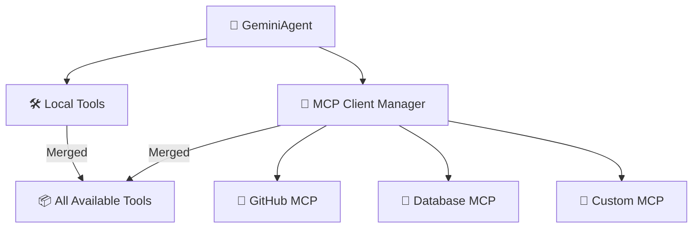

# 🔌 MCP Integration Guide

## 🌐 What is MCP?

The [Model Context Protocol (MCP)](https://modelcontextprotocol.io/) is a standardized protocol for connecting AI applications to external tools and data sources. With MCP, your agent can:

- 🔗 Connect multiple MCP servers simultaneously
- 🛠️ Use any tools exposed by those servers
- 📊 Access databases, APIs, filesystems, browsers, and more
- 🔄 Merge remote tools with local ones transparently

## 🚀 Quick Setup

### 1. Enable MCP in `.env`
```bash
MCP_ENABLED=true
```

### 2. Configure Servers in `mcp_servers.json`

```json
{
  "servers": [
    {
      "name": "github",
      "transport": "stdio",
      "command": "npx",
      "args": ["-y", "@modelcontextprotocol/server-github"],
      "enabled": true,
      "env": {
        "GITHUB_PERSONAL_ACCESS_TOKEN": "${GITHUB_TOKEN}"
      }
    },
    {
      "name": "filesystem",
      "transport": "stdio",
      "command": "npx",
      "args": ["-y", "@modelcontextprotocol/server-filesystem", "/tmp"],
      "enabled": true
    }
  ]
}
```

### 3. Run the Agent
```bash
python src/agent.py
```

The agent will:
- 🔌 Connect to all enabled MCP servers
- 🔍 Discover available tools
- 📦 Merge them with local tools
- ✅ Ready to use

## 🏗️ Architecture



## 📡 Supported Transports

| Transport | Description | Use Case |
|-----------|-------------|----------|
| `stdio` | Standard I/O | Local servers, CLI tools |
| `http` | Streamable HTTP | Remote servers, cloud services |
| `sse` | Server-Sent Events | Legacy HTTP servers |

## 🛠️ Built-in MCP Helper Tools

Once MCP is enabled, these helper tools are automatically available:

- **`list_mcp_servers()`** — List all connected MCP servers
- **`list_mcp_tools()`** — Enumerate all available MCP tools
- **`get_mcp_tool_help(tool_name)`** — Show help/documentation for a tool
- **`mcp_health_check()`** — Check the health status of all servers

## 📋 Pre-configured Servers

`mcp_servers.json` includes templates for these popular servers:

| Server | Description | Status |
|--------|-------------|--------|
| 🗂️ **Filesystem** | File system operations | Ready |
| 🐙 **GitHub** | GitHub API access | Ready |
| 🗃️ **PostgreSQL** | Database operations | Ready |
| 🔍 **Brave Search** | Web search | Ready |
| 💾 **Memory** | Persistent storage | Ready |
| 🌐 **Puppeteer** | Browser automation | Ready |
| 💬 **Slack** | Slack messaging | Ready |

Enable what you need and add your API keys.

## 🔧 Creating Custom MCP Servers

Build your own MCP server using the [MCP Python SDK](https://github.com/modelcontextprotocol/python-sdk) with FastMCP:

### Example: Custom Analysis Server

```python
from mcp.server.fastmcp import FastMCP
from mcp.types import Tool, TextContent

mcp = FastMCP("My Analysis Server")

@mcp.tool()
def analyze_text(text: str) -> str:
    """Analyzes text sentiment and extracts key insights."""
    # Your analysis logic here
    return f"Analysis of: {text}"

@mcp.tool()
def generate_summary(content: str, max_length: int = 100) -> str:
    """Generates a summary of given content."""
    return content[:max_length] + "..."

if __name__ == "__main__":
    mcp.run()
```

### Register Custom Server

1. Save your server to `src/tools/my_server.py`
2. Add to `mcp_servers.json`:

```json
{
  "name": "my-analysis",
  "transport": "stdio",
  "command": "python",
  "args": ["src/tools/my_server.py"],
  "enabled": true
}
```

3. Restart the agent—your new tools are available!

## 🔐 Security Considerations

### Environment Variables
Always use environment variables for sensitive data:

```json
{
  "env": {
    "GITHUB_TOKEN": "${GITHUB_PERSONAL_ACCESS_TOKEN}",
    "DB_PASSWORD": "${DB_PASSWORD}"
  }
}
```

The `${VAR_NAME}` syntax automatically injects from your `.env` file.

### Sandboxing
For untrusted servers, consider:
- Running in isolated Docker containers
- Using restrictive file permissions
- Monitoring tool calls for malicious patterns

## 🧪 Testing MCP Integration

```python
# Test MCP connection
from src.mcp_client import MCPClient

client = MCPClient()
servers = client.list_servers()
print(f"Connected to {len(servers)} servers")

# List available tools
tools = client.list_tools()
for tool in tools:
    print(f"- {tool['name']}: {tool['description']}")
```

## 🐛 Troubleshooting

### Server won't connect
```bash
# Check if server process starts
python src/tools/my_server.py

# Verify command exists
which npx
```

### Tools not appearing
```bash
# Restart agent
python src/agent.py

# Check logs
grep "MCP" agent.log
```

### Performance issues
- 📦 Disable unused servers in `mcp_servers.json`
- 🚀 Use `http` transport for remote servers
- 💾 Implement tool result caching

## 📚 Resources

- [MCP Official Documentation](https://modelcontextprotocol.io/)
- [MCP Python SDK](https://github.com/modelcontextprotocol/python-sdk)
- [FastMCP Examples](https://github.com/modelcontextprotocol/python-sdk/tree/main/examples)

---

**Next:** [Swarm Protocol](SWARM_PROTOCOL.md) | [Full Index](README.md)
