# 🌟 Project Philosophy

## The Vision Behind Antigravity Workspace

In an era rich with AI IDEs, the goal was to achieve an enterprise-grade architecture with just **Clone -> Rename -> Prompt**.

This project leverages the IDE's context awareness (via `.cursorrules` and `.antigravity/rules.md`) to embed a complete **Cognitive Architecture** directly into the project files.

When you open this project, your IDE is no longer just an editor; it transforms into a **"Knowledgeable" Architect**.

## Why do we need a "Thinking" Scaffold?

When using Google Antigravity or Cursor for AI development, there's a pain point:

**IDEs and models are powerful, but "empty projects" are weak.**

Every time we start a new project, we repeat boring configurations:
- "Should my code go in src or app?"
- "How do I define tool functions so Gemini recognizes them?"
- "How do I make the AI remember context?"

This repetitive labor is a waste of creativity. The ideal workflow is: **Git Clone -> IDE already knows what to do.**

So this project was created: **Antigravity Workspace Template**.

## 🧠 Core Philosophy: Artifact-First

This workspace enforces the **Artifact-First** protocol. The Agent does not just write code; it produces tangible outputs (Artifacts) for every complex task.

### The Three Pillars

1. **Planning**: `artifacts/plan_[task_id].md` is created before coding.
2. **Evidence**: Logs and test outputs are saved to `artifacts/logs/`.
3. **Visuals**: UI changes generate screenshot artifacts.

This ensures that every task produces a trail of evidence that can be reviewed, audited, and improved.

## 🛸 How It Works

The agent follows a strict "Think-Act-Reflect" loop, simulating the cognitive process of Gemini 2.0 Flash.

```mermaid
sequenceDiagram
    participant User
    participant Agent as 🤖 GeminiAgent
    participant Memory as 🧠 Memory
    participant Tools as 🛠️ Tools
    participant Artifacts as 📂 Artifacts

    User->>Agent: "Refactor Authentication"
    activate Agent
    
    Agent->>Artifacts: Create Implementation Plan
    
    Note over Agent: <thought> Deep Think Process </thought>
    Agent->>Agent: Formulate Strategy
    
    Agent->>Tools: Execute Tool (code_edit)
    activate Tools
    Tools-->>Agent: Result
    deactivate Tools
    
    Agent->>Artifacts: Save Logs/Evidence
    
    Agent-->>User: Final Report (Walkthrough)
    deactivate Agent
```

## 🔥 Killer Features

- 🧠 **Infinite Memory Engine**: Recursive summarization automatically compresses history. Context limits are a thing of the past.
- 🛠️ **Universal Tool Protocol**: Generic ReAct pattern. Just register any Python function in `available_tools`, and the Agent learns to use it.
- ⚡️ **Gemini Native**: Optimized for Gemini 2.0 Flash's speed and function calling capabilities.
- 🔌 **External LLM (OpenAI-format)**: Call any OpenAI-compatible API via the built-in `call_openai_chat` tool (supports OpenAI/Azure/Ollama).

---

**Next:** [Quick Start Guide](QUICK_START.md) | [Full Index](README.md)
