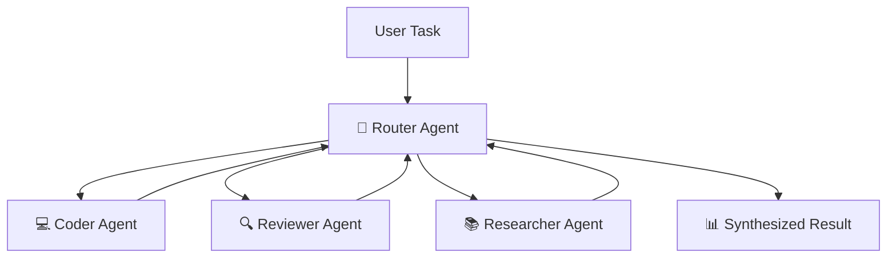

# 🔥 Multi-Agent Swarm Protocol

## 🪐 Architecture: Router-Worker Pattern

The Antigravity Workspace includes a sophisticated multi-agent swarm system based on the Router-Worker pattern. This allows complex tasks to be decomposed and handled by specialist agents working in coordination.



## 🧠 Specialist Agents

### 🧭 Router Agent
**Role**: Task analyzer, strategist, and conductor

The Router analyzes incoming tasks, determines the best decomposition strategy, delegates subtasks to specialists, and synthesizes final results.

**Capabilities:**
- 🎯 Complex task analysis
- 📋 Strategic planning
- 🔀 Work distribution
- 🧩 Result synthesis

### 💻 Coder Agent
**Role**: Implementation specialist

Writes clean, well-documented, production-ready code following Google style guide conventions.

**Specialties:**
- 🐍 Python development
- 🎨 Clean code architecture
- 📝 Comprehensive docstrings
- 🧪 Test coverage

### 🔍 Reviewer Agent
**Role**: Quality assurance expert

Reviews implementations for correctness, security, performance, and best practices.

**Specialties:**
- ✅ Code quality assessment
- 🔒 Security analysis
- ⚡ Performance optimization
- 📋 Best practice verification

### 📚 Researcher Agent
**Role**: Information gatherer and investigator

Researches solutions, gathers context, and provides foundational knowledge for complex tasks.

**Specialties:**
- 🔎 Problem research
- 📚 Information synthesis
- 🧠 Context gathering
- 💡 Insight generation

## 🚀 Using the Swarm

### Run Interactive Demo

```bash
python -m src.swarm_demo
```

This launches an interactive prompt where you can assign tasks to the swarm and watch specialists collaborate.

### Example Interaction

```
🧭 [Router] What task would you like me to help with?
> Build a calculator that supports basic math operations and review it for security

🧭 [Router] Analyzing task...
📤 [Router → Coder] Build a calculator with +, -, *, / operations
💻 [Coder] Creating calculator implementation...
📝 [Coder] Generating comprehensive tests...
✅ [Coder] Implementation complete!

📤 [Router → Reviewer] Review calculator for security and best practices
🔍 [Reviewer] Analyzing code structure...
🔍 [Reviewer] Security assessment: No vulnerabilities found ✅
🔍 [Reviewer] Performance assessment: Optimal ✅
✅ [Reviewer] Review complete!

🎉 [Router] Task completed successfully!
📊 Final Summary:
   - Implementation: calculator.py ✅
   - Tests: calculator_test.py ✅
   - Review: All checks passed ✅
```

### Programmatic Usage

```python
from src.swarm import SwarmOrchestrator

# Initialize swarm
swarm = SwarmOrchestrator()

# Execute a task
result = swarm.execute(
    "Build a file compression utility with error handling"
)

# Access results
print(f"Status: {result['status']}")
print(f"Output: {result['output']}")
print(f"Artifacts: {result['artifacts']}")
```

## 🔧 Configuration

### Swarm Settings

Edit the swarm configuration in `.antigravity/swarm_config.json`:

```json
{
  "router": {
    "model": "gemini-2.0-flash",
    "temperature": 0.7,
    "max_iterations": 5
  },
  "workers": {
    "coder": {
      "enabled": true,
      "timeout": 300
    },
    "reviewer": {
      "enabled": true,
      "timeout": 120
    },
    "researcher": {
      "enabled": true,
      "timeout": 180
    }
  },
  "parallel_execution": false,
  "log_level": "INFO"
}
```

### Custom Agents

Add custom specialist agents by extending `BaseAgent`:

```python
# src/agents/custom_agent.py
from src.agents.base_agent import BaseAgent

class DataAnalystAgent(BaseAgent):
    """Specialist agent for data analysis tasks."""
    
    def __init__(self, name="DataAnalyst"):
        super().__init__(name=name)
        self.specialization = "data analysis"
    
    def execute(self, task: str) -> str:
        """Execute data analysis task."""
        # Implementation here
        return result
```

Register in `swarm.py`:

```python
from src.agents.custom_agent import DataAnalystAgent

agents = {
    "coder": CoderAgent(),
    "reviewer": ReviewerAgent(),
    "researcher": ResearcherAgent(),
    "data_analyst": DataAnalystAgent(),  # Add custom agent
}
```

## 📊 Monitoring & Logging

### View Swarm Logs

```bash
# Real-time log stream
tail -f artifacts/logs/swarm.log

# Filter by agent
grep "Coder" artifacts/logs/swarm.log

# Search by task
grep "calculator" artifacts/logs/swarm.log
```

### Task Artifacts

After each swarm execution, outputs are saved to `artifacts/`:

```
artifacts/
├── plan_task_id.md        # Original task plan
├── logs/
│   └── swarm_task_id.log  # Detailed execution log
├── implementations/
│   ├── calculator.py      # Generated code
│   └── test_calculator.py # Generated tests
└── reviews/
    └── calculator_review.md # Review report
```

## ⚡ Performance Tips

### Optimize Execution
- 🎯 Keep task descriptions clear and focused
- 🔄 Enable parallel execution for independent subtasks
- 📦 Pre-load context for better agent understanding
- ⏱️ Set appropriate timeouts for long-running agents

### Resource Management
- 🚫 Disable unused agents in configuration
- 💾 Implement result caching
- 🧹 Clean old artifacts periodically

## 🐛 Troubleshooting

### Agents won't connect
```bash
# Check if all agents are initialized
python -c "from src.swarm import SwarmOrchestrator; s = SwarmOrchestrator(); print(s.available_agents())"
```

### Task execution hangs
```bash
# Check agent status
grep "ERROR" artifacts/logs/swarm.log

# Increase timeout in configuration
# Edit .antigravity/swarm_config.json and restart
```

### Low quality results
- 📚 Provide more context to the swarm
- 🎯 Be more specific in task descriptions
- 🔄 Enable reviewer agent for quality checks

## 📚 Examples

### Example 1: Web Scraper Development
```python
from src.swarm import SwarmOrchestrator

swarm = SwarmOrchestrator()
result = swarm.execute(
    """
    Build a web scraper that:
    1. Fetches news articles from a website
    2. Extracts headline, author, date
    3. Stores in JSON format
    4. Includes error handling
    """
)
```

### Example 2: API Server with Testing
```python
result = swarm.execute(
    """
    Create a Flask REST API with:
    - GET /users endpoint
    - POST /users endpoint with validation
    - Comprehensive unit tests
    - Security review for vulnerabilities
    """
)
```

## 📞 Advanced Topics

- **Custom Agent Development**: Extend `BaseAgent` for specialized domains
- **Parallel Execution**: Configure agents for concurrent subtask handling
- **Inter-Agent Communication**: Use message passing for complex coordination
- **Result Verification**: Implement custom verification strategies

See [Full Index](README.md) for more resources.

---

**Next:** [Zero-Config Features](ZERO_CONFIG.md) | [Full Index](README.md)
