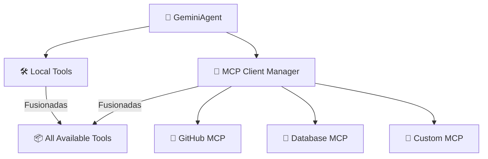

# 🔌 Guía de Integración de MCP

## 🌐 ¿Qué es MCP?

El [Protocolo de Contexto del Modelo (MCP)](https://modelcontextprotocol.io/) es un protocolo estandarizado para conectar aplicaciones de IA a fuentes externas de herramientas y datos. Con MCP, tu agente puede:

- 🔗 Conectarse a múltiples servidores MCP simultáneamente
- 🛠️ Usar cualquier herramienta expuesta por esos servidores
- 📊 Acceder a bases de datos, APIs, sistemas de archivos, navegadores y más
- 🔄 Fusionar herramientas remotas con locales de forma transparente

## 🚀 Configuración Rápida

### 1. Habilitar MCP en `.env`
```bash
MCP_ENABLED=true
```

### 2. Configurar Servidores en `mcp_servers.json`

```json
{
  "servers": [
    {
      "name": "github",
      "transport": "stdio",
      "command": "npx",
      "args": ["-y", "@modelcontextprotocol/server-github"],
      "enabled": true,
      "env": {
        "GITHUB_PERSONAL_ACCESS_TOKEN": "${GITHUB_TOKEN}"
      }
    }
  ]
}
```

### 3. Ejecutar el Agente
```bash
python src/agent.py
```

El agente:
- 🔌 Se conectará a todos los servidores MCP habilitados
- 🔍 Descubrirá herramientas disponibles
- 📦 Las fusionará con herramientas locales
- ✅ Listo para usar

## 🏗️ Arquitectura



## 📡 Transportes Soportados

| Transporte | Descripción | Caso de Uso |
|-----------|-------------|----------|
| `stdio` | Entrada/Salida Estándar | Servidores locales, herramientas CLI |
| `http` | HTTP Transmisible | Servidores remotos, servicios en la nube |
| `sse` | Server-Sent Events | Servidores HTTP heredados |

## 🛠️ Herramientas MCP Integradas

Una vez que MCP está habilitado, estas herramientas auxiliares están automáticamente disponibles:

- **`list_mcp_servers()`** — Listar todos los servidores MCP conectados
- **`list_mcp_tools()`** — Enumerar todas las herramientas MCP disponibles
- **`get_mcp_tool_help(tool_name)`** — Mostrar ayuda/documentación para una herramienta
- **`mcp_health_check()`** — Verificar el estado de salud de todos los servidores

## 📋 Servidores Preconfigurados

`mcp_servers.json` incluye plantillas para estos servidores populares:

| Servidor | Descripción | Estado |
|---------|-------------|--------|
| 🗂️ **Filesystem** | Operaciones del sistema de archivos | Listo |
| 🐙 **GitHub** | Acceso a API de GitHub | Listo |
| 🗃️ **PostgreSQL** | Operaciones de base de datos | Listo |
| 🔍 **Brave Search** | Búsqueda web | Listo |
| 💾 **Memory** | Almacenamiento persistente | Listo |
| 🌐 **Puppeteer** | Automatización de navegador | Listo |
| 💬 **Slack** | Mensajería de Slack | Listo |

Habilita lo que necesites y agrega tus claves de API.

## 🔧 Crear Servidores MCP Personalizados

Crea tu propio servidor MCP usando el [SDK de MCP Python](https://github.com/modelcontextprotocol/python-sdk) con FastMCP:

```python
from mcp.server.fastmcp import FastMCP

mcp = FastMCP("Mi Servidor Personalizado")

@mcp.tool()
def mi_herramienta_personalizada(texto: str) -> str:
    """Analiza texto personalizado."""
    return f"Analizado: {texto}"

if __name__ == "__main__":
    mcp.run()
```

Regístralo en `mcp_servers.json`:

```json
{
  "name": "mi-servidor",
  "transport": "stdio",
  "command": "python",
  "args": ["ruta/a/mi_servidor.py"],
  "enabled": true
}
```

---

**Siguiente:** [Protocolo de Swarm](SWARM_PROTOCOL.md) | [Índice Completo](README.md)
