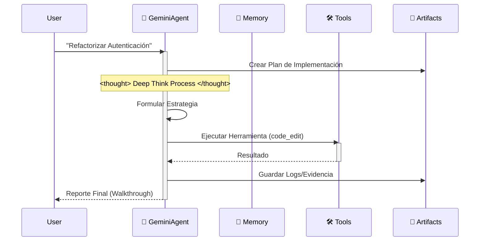

# 🌟 Filosofía del Proyecto

## La Visión Detrás de Antigravity Workspace

En una era rica de IDEs de IA, el objetivo era lograr una arquitectura de nivel empresarial con simplemente **Clonar -> Renombrar -> Solicitar**.

Este proyecto aprovecha la conciencia contextual del IDE (mediante `.cursorrules` y `.antigravity/rules.md`) para integrar una **Arquitectura Cognitiva** completa directamente en los archivos del proyecto.

Cuando abres este proyecto, tu IDE ya no es solo un editor; se transforma en un **"Arquitecto Conocedor"**.

## ¿Por qué necesitamos un "Scaffold de Pensamiento"?

Al usar Google Antigravity o Cursor para desarrollo de IA, hay un punto de dolor:

**Los IDEs y modelos son poderosos, pero los "proyectos vacíos" son débiles.**

Cada vez que comenzamos un nuevo proyecto, repetimos configuraciones aburridas:
- "¿Debería mi código ir en src o en app?"
- "¿Cómo defino funciones de herramienta para que Gemini las reconozca?"
- "¿Cómo hago que la IA recuerde el contexto?"

Este trabajo repetitivo es un desperdicio de creatividad. El flujo de trabajo ideal es: **Git Clone -> El IDE ya sabe qué hacer.**

Por eso se creó este proyecto: **Antigravity Workspace Template**.

## 🧠 Filosofía Central: Artifact-First

Este workspace aplica el protocolo **Artifact-First**. El Agente no solo escribe código; produce outputs tangibles (Artefactos) para cada tarea compleja.

### Los Tres Pilares

1. **Planificación**: Se crea `artifacts/plan_[task_id].md` antes de codificar.
2. **Evidencia**: Logs y outputs de pruebas se guardan en `artifacts/logs/`.
3. **Visuales**: Los cambios de UI generan artefactos de captura de pantalla.

Esto garantiza que cada tarea produce un rastro de evidencia que puede ser revisado, auditado y mejorado.

## 🛸 Cómo Funciona

El agente sigue un estricto bucle "Think-Act-Reflect", simulando el proceso cognitivo de Gemini 2.0 Flash.

## 🔥 Características Destacadas

- 🧠 **Motor de Memoria Infinita**: La resumización recursiva comprime automáticamente el historial. Los límites de contexto se acabaron.
- 🛠️ **Protocolo Universal de Herramientas**: Patrón genérico ReAct. Solo registra cualquier función Python en `available_tools`, y el Agente aprende a usarla.
- ⚡️ **Nativo de Gemini**: Optimizado para la velocidad de Gemini 2.0 Flash y capacidades de function calling.
- 🔌 **Soporte de LLM Externo (formato OpenAI)**: Llama cualquier API compatible con OpenAI mediante la herramienta `call_openai_chat` (soporta OpenAI, Azure, Ollama).

---

**Siguiente:** [Guía de Inicio Rápido](QUICK_START.md) | [Índice Completo](README.md)
