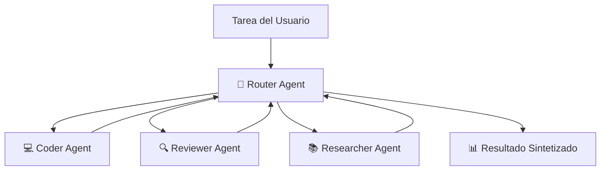

# 🔥 Protocolo de Swarm Multi-Agente

## 🪐 Arquitectura: Patrón Router-Worker

El Antigravity Workspace incluye un sistema de swarm de múltiples agentes sofisticado basado en el patrón Router-Worker. Esto permite descomponer tareas complejas y manejarlas con agentes especialistas trabajando en coordinación.



## 🧠 Agentes Especialistas

### 🧭 Agente Router
**Rol**: Analizador de tareas, estratega y director

El Router analiza tareas entrantes, determina la mejor estrategia de descomposición, delega subtareas a especialistas y sintetiza resultados finales.

**Capacidades:**
- 🎯 Análisis de tareas complejas
- 📋 Planificación estratégica
- 🔀 Distribución de trabajo
- 🧩 Síntesis de resultados

### 💻 Agente Coder
**Rol**: Especialista en implementación

Escribe código limpio, bien documentado y listo para producción siguiendo convenciones de Google style guide.

**Especialidades:**
- 🐍 Desarrollo en Python
- 🎨 Arquitectura de código limpio
- 📝 Docstrings integrales
- 🧪 Cobertura de pruebas

### 🔍 Agente Reviewer
**Rol**: Experto en aseguramiento de calidad

Revisa implementaciones para corrección, seguridad, rendimiento y mejores prácticas.

**Especialidades:**
- ✅ Evaluación de calidad de código
- 🔒 Análisis de seguridad
- ⚡ Optimización de rendimiento
- 📋 Verificación de mejores prácticas

### 📚 Agente Researcher
**Rol**: Recopilador de información e investigador

Investiga soluciones, recopila contexto y proporciona conocimiento fundamental para tareas complejas.

**Especialidades:**
- 🔎 Investigación de problemas
- 📚 Síntesis de información
- 🧠 Recopilación de contexto
- 💡 Generación de insights

## 🚀 Usando el Swarm

### Ejecutar Demo Interactivo

```bash
python -m src.swarm_demo
```

Esto inicia un prompt interactivo donde puedes asignar tareas al swarm y ver a especialistas colaborar.

### Ejemplo de Interacción

```
🧭 [Router] ¿Con qué tarea puedo ayudarte?
> Construye una calculadora que soporte operaciones matemáticas básicas y revísala por seguridad

🧭 [Router] Analizando tarea...
📤 [Router → Coder] Construir calculadora con +, -, *, / operaciones
💻 [Coder] Creando implementación de calculadora...
📝 [Coder] Generando pruebas integrales...
✅ [Coder] ¡Implementación completa!

📤 [Router → Reviewer] Revisar calculadora por seguridad y mejores prácticas
🔍 [Reviewer] Analizando estructura de código...
🔍 [Reviewer] Evaluación de seguridad: Sin vulnerabilidades encontradas ✅
🔍 [Reviewer] Evaluación de rendimiento: Óptimo ✅
✅ [Reviewer] ¡Revisión completa!

🎉 [Router] ¡Tarea completada con éxito!
```

### Uso Programático

```python
from src.swarm import SwarmOrchestrator

# Inicializar swarm
swarm = SwarmOrchestrator()

# Ejecutar una tarea
result = swarm.execute(
    "Construye una utilidad de compresión de archivos con manejo de errores"
)

# Acceder a resultados
print(f"Estado: {result['status']}")
print(f"Output: {result['output']}")
print(f"Artefactos: {result['artifacts']}")
```

---

**Siguiente:** [Características Zero-Config](ZERO_CONFIG.md) | [Índice Completo](README.md)
